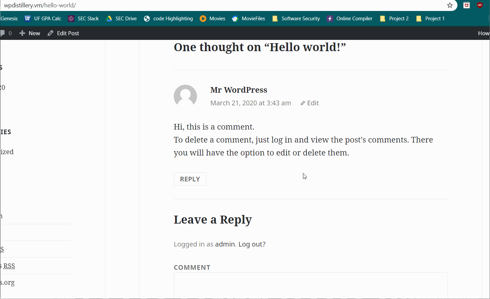
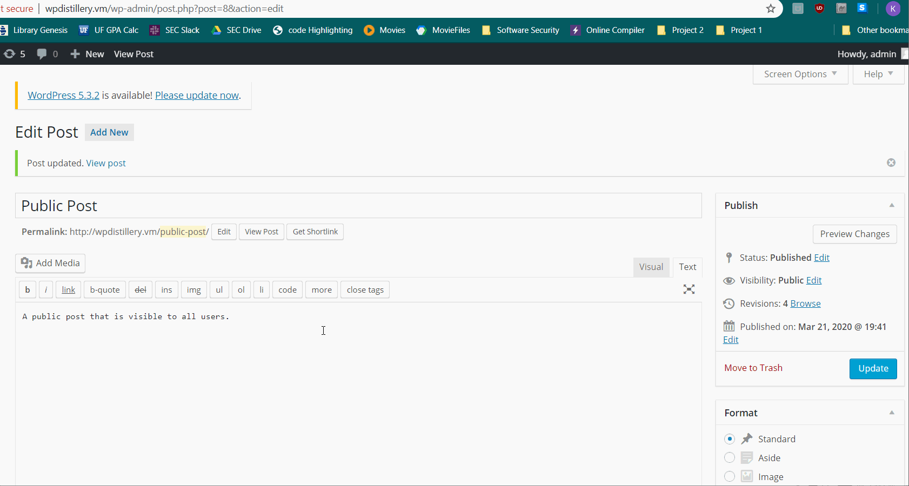

# Project 7 - WordPress Pentesting

Time spent: **8** hours spent in total

> Objective: Find, analyze, recreate, and document **five vulnerabilities** affecting an old version of WordPress

## Pentesting Report

1. (Required) Unauthenticated Stored Cross-Site Scripting (XSS)
  - [ ] Summary: Allows XSS through comments that are larger thab 64kb in size. MYSQL TEXT type only allows 64kb of data so overloaded this truncates text and creates malformed HTML on the page.
    - Vulnerability types: XSS
    - Tested in version: 4.2
    - Fixed in version: 4.2.1
  - [ ] GIF Walkthrough: 
  - [ ] Steps to recreate: Create a comment with an alert that also contains comment text >64kb in size.
        ```
        <a title='x onmouseover=alert(unescape(/hello%20world/.source)) style=position:absolute;left:0;top:0;width:5000px;height:5000px  AAAAAAAAAAAA...[64 kb]..AAA'></a>
        ```
  - [ ] Affected source code: N/A - MYSQL Limitation

1. (Required) Authenticated Shortcode Tags Cross-Site Scripting (XSS)
  - [ ] Summary: Allows storing XSS in clickable links by bypassing WordPress HTML tag filters. This is accomplished by abusing the seperate handling of shortcode and HTML validation. This penetration can be done by anyone with the ability to create posts which is exacerbated by the fact that 4.2 contains a core WordPress vulnerability allowing unautherized users to create posts.
    - Vulnerability types: XSS
    - Tested in version: 4.2
    - Fixed in version: 4.2.5
  - [ ] GIF Walkthrough: 
  - [ ] Steps to recreate: Create a post that contains the following code:
  ```
  TEST!!![caption width="1" caption='<a href="' ">]</a><a href="http://onMouseOver='alert(1)'">Click me</a>
  ```
  - [ ] Affected source code: Code handling HTML tags and shortcode filtering
    - [Link 1](https://github.com/WordPress/WordPress/commit/f72b21af23da6b6d54208e5c1d65ececdaa109c8)

1. (Required) Authenticated Stored Cross-Site Scripting (XSS) in YouTube URL Embeds
  - [ ] Summary: YouTube links are autoembedded by WordPress and do not sanitize the url following the domain. This allows us to enter scripts as the url and execute them on the page they are located in.
    - Vulnerability types: XSS
    - Tested in version: 4.2
    - Fixed in version: 4.2.13
  - [ ] GIF Walkthrough: 
  - [ ] Steps to recreate: Create a post containing the following code:
  ```
  https://youtube.com/watch?v=dQw4w9WgXcQ<svg onload=alert('XSS')>
  ```
  Note that any YouTube link will do and that the link does not even have to be from a valid source.
  - [ ] Affected source code: Code handling youtube link embedding
    - [Link 1](https://github.com/WordPress/WordPress/commit/419c8d97ce8df7d5004ee0b566bc5e095f0a6ca8)

## Assets

List any additional assets, such as scripts or files

## Resources

- [WordPress Source Browser](https://core.trac.wordpress.org/browser/)
- [WordPress Developer Reference](https://developer.wordpress.org/reference/)
- [Exploit 1 Information](https://wpvulndb.com/vulnerabilities/7945)
- [Exploit 1 Reference](https://klikki.fi/adv/wordpress2.html)
- [Exploit 2 Information](https://wpvulndb.com/vulnerabilities/8186)
- [Exploit 2 Reference](https://blog.checkpoint.com/2015/09/15/finding-vulnerabilities-in-core-wordpress-a-bug-hunters-trilogy-part-iii-ultimatum/)
- [Exploit 3 Information](https://wpvulndb.com/vulnerabilities/8768)
- [Exploit 3 Reference](https://blog.sucuri.net/2017/03/stored-xss-in-wordpress-core.html)

GIFs created with [LiceCap](http://www.cockos.com/licecap/).

## Notes

There were a lot of cool vulnerabilities available to be abused but my lack of skill and knowledge made a lot of them out of reach for me. One wad [Stored Cross-Site Scripting (XSS) via Theme Name fallback](https://wpvulndb.com/vulnerabilities/8718) which was very interestign and pertained to a type of vulnerability we learned about in class. It presented a lto of challenged and required me to modify my .htaccess to increase my upload_max_filesize so that I could upload the theme to execute the XSS. Ultimately I could not get WPDistillery to change over to my corrupted XSS theme and I suspect it is because my VM is not hosted in a Linux environment.nOther vulnerabilites showed the faulty lines of code but interpreting an attack from them required knowledge beyond me or scripts that directly interfaced with the WPDistillery page.

## License

    Copyright 2020 Kevin Thomas

    Licensed under the Apache License, Version 2.0 (the "License");
    you may not use this file except in compliance with the License.
    You may obtain a copy of the License at

        http://www.apache.org/licenses/LICENSE-2.0

    Unless required by applicable law or agreed to in writing, software
    distributed under the License is distributed on an "AS IS" BASIS,
    WITHOUT WARRANTIES OR CONDITIONS OF ANY KIND, either express or implied.
    See the License for the specific language governing permissions and
    limitations under the License.
